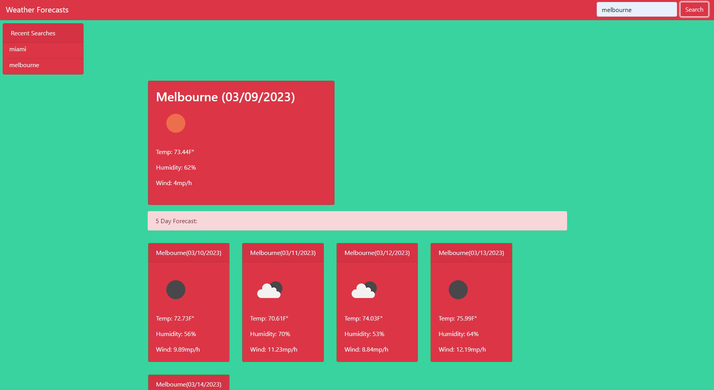

# cloudyprophecies
  

- [Installation](#installation)

- [Usage](#usage)

- [Contribution](#contributing)

- [License](#license)

## License

an interactive weather forecasting app

## Installation

simply pull up the webpage and search

## Usage

 
 

## Contributing

please do not contribute

## Testing

click on whatever you like!

## Questions

Contact me!

Github: https://github.com/azrazel95

Email: beni.sprenger@hotmail.com

